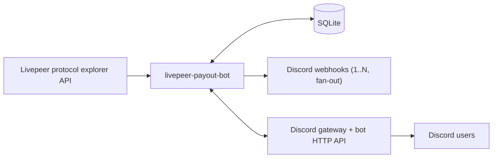
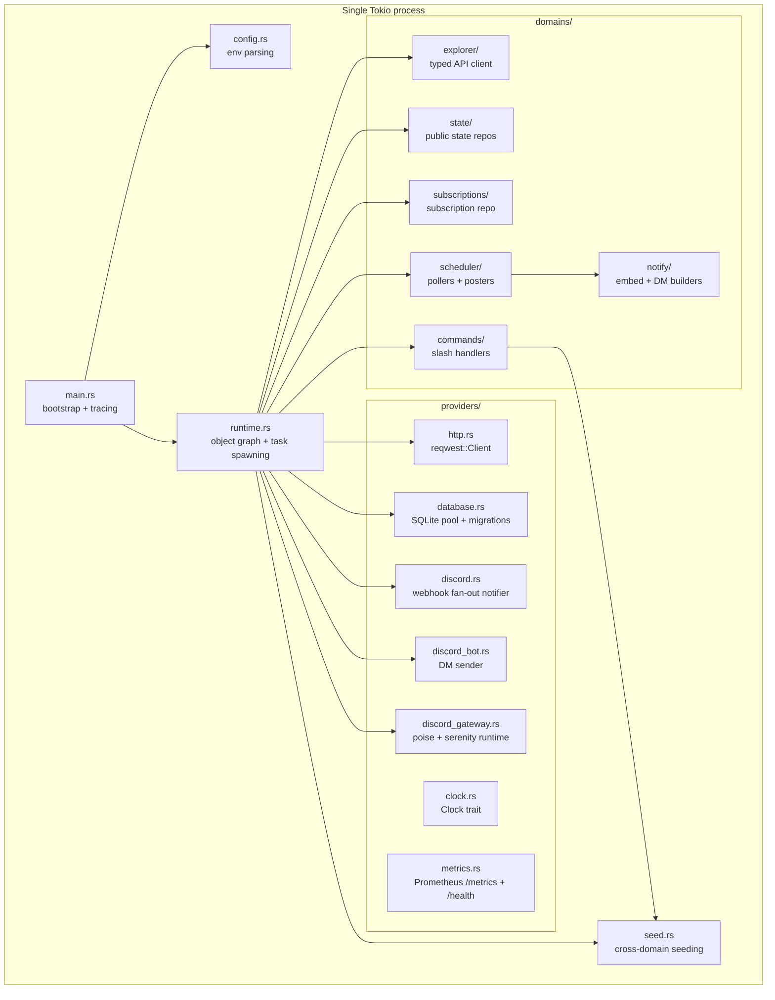
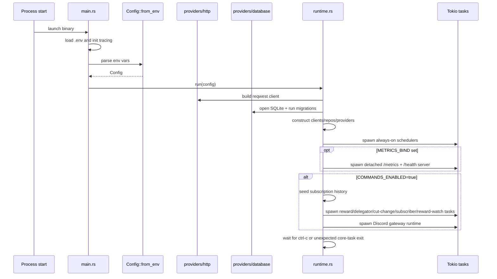
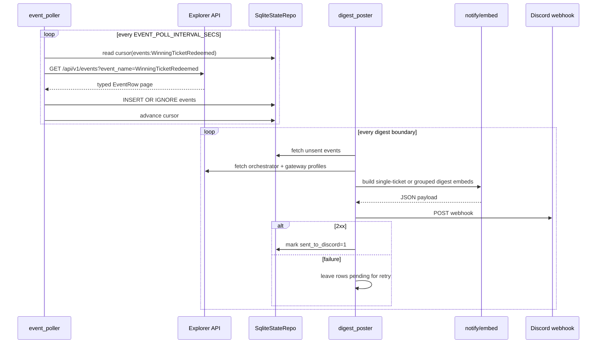
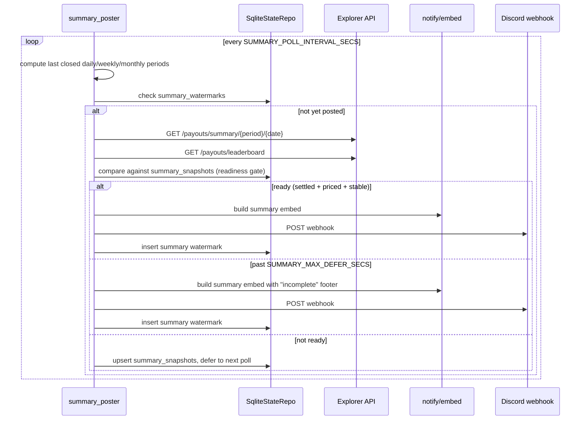
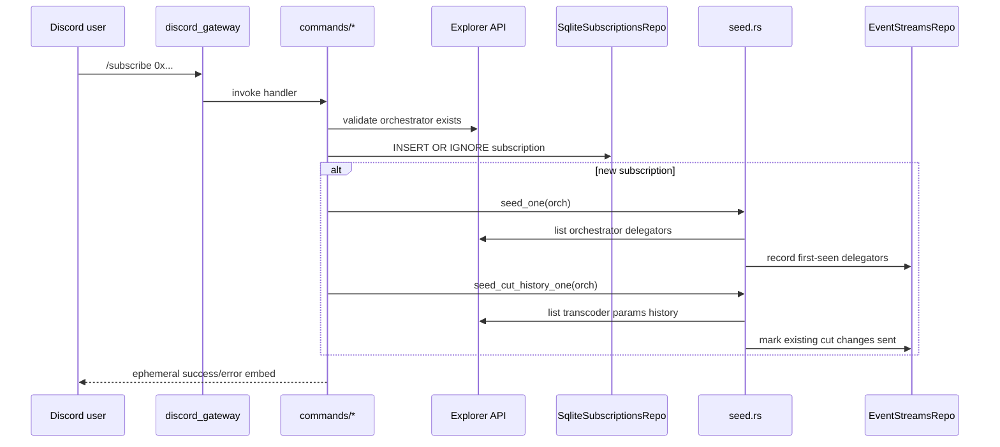
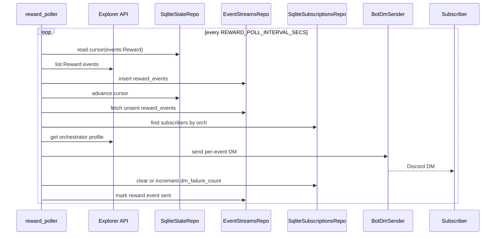
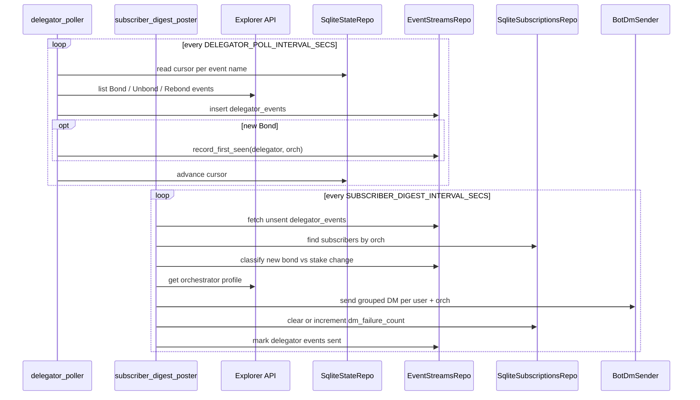
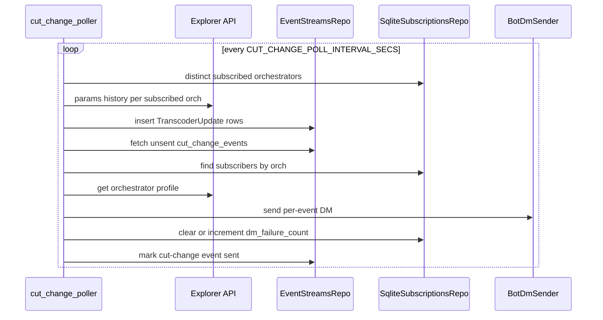
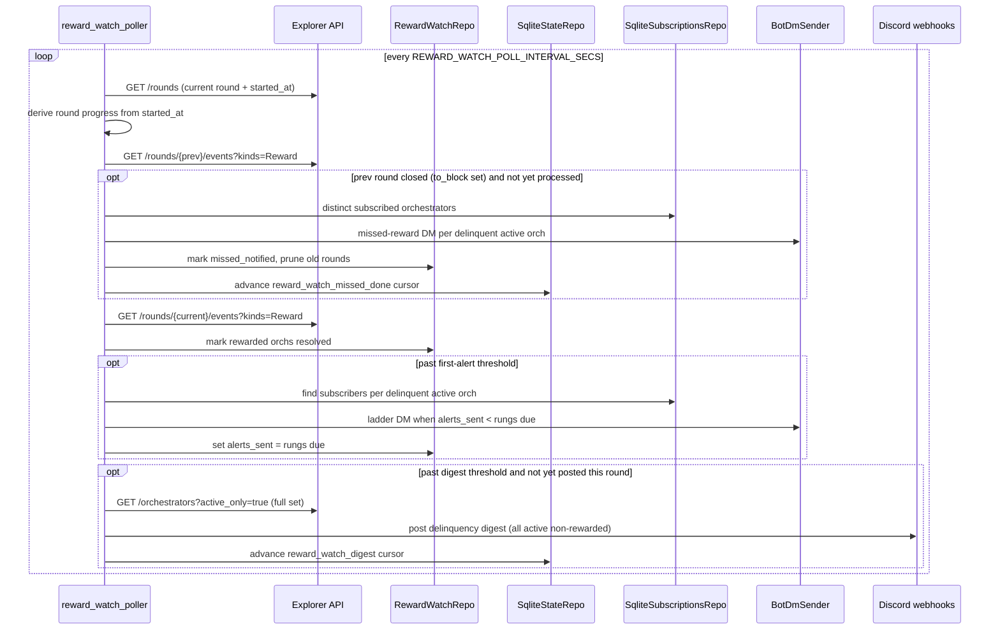

# Architecture

## One-paragraph summary

`livepeer-payout-bot` is a single Rust process that polls the Livepeer protocol explorer REST API, stores cursors and delivery state in SQLite, and sends Discord notifications. In its base shape it posts public webhook digests for `WinningTicketRedeemed` events plus daily/weekly/monthly network summaries. When `COMMANDS_ENABLED=true`, it also opens a Discord gateway connection, serves slash commands, stores user subscriptions, seeds subscription-scoped history, delivers subscriber DMs for `Reward`, delegator activity, and reward-cut / fee-share changes, and runs the reward-call watch (escalating "reward not called yet" DMs per round, a public delinquency digest at round lock, and a final missed-reward DM after round close). An optional Prometheus `/metrics` + `/health` endpoint is served when `METRICS_BIND` is set.

## Architectural goals

- Keep upstream integration narrow: one explorer REST API contract, one SQLite file, one Discord surface (public posts fan out to N configured webhooks through a single notifier).
- Preserve deterministic delivery semantics: persist first, mark sent after successful delivery.
- Make boundaries explicit and typed so contract drift fails in code review and tests, not at runtime.
- Keep deployment simple: one binary, no external scheduler, no separate database service.
- Allow the slash-command/DM feature set without contaminating the webhook-only core.

## System context

## Deployment modes

### 1. Webhook-only mode

Enabled when `COMMANDS_ENABLED=false`.

Long-lived tasks:

- `event_poller`
- `digest_poster` (only when `WEBHOOK_POST_ENABLED=true`)
- `summary_poster` (only when `WEBHOOK_POST_ENABLED=true`)

Used for public-channel reporting only.

`WEBHOOK_POST_ENABLED` defaults to `true`. Setting it to `false` is a
dev-side safety flag: events still poll and persist, but the digest and
summary posters are not spawned, so nothing is sent to
`DISCORD_WEBHOOK_URL`. The flag exists so a dev process can share a
webhook URL with prod without double-posting.

### 2. Commands-enabled mode

Enabled when `COMMANDS_ENABLED=true`.

Includes everything from webhook-only mode, plus:

- startup seeding of `delegator_history`
- startup seeding of existing cut-change history into `cut_change_events`
- Discord gateway runtime for slash commands
- `reward_poller`
- `delegator_poller`
- `cut_change_poller`
- `subscriber_digest_poster`
- `reward_watch_poller` (unless `REWARD_WATCH_ENABLED=false`; its public
  delinquency digest additionally honors `WEBHOOK_POST_ENABLED`)

Used for interactive subscriptions and direct-message fan-out.

## Component model

## Domain layering and dependency rules

The repo does not use unconstrained “feature modules.” It uses stratified domains with specific import rules.

| Layer | Modules | Allowed cross-domain imports |
|---|---|---|
| Strict leaves | `explorer`, `subscriptions` | none |
| Persistence | `state` | `explorer::types` only |
| Formatters | `notify` | typed leaves as input |
| Composers | `scheduler`, `commands` | any domain as needed |
| Crate-root orchestration | `runtime.rs`, `seed.rs` | cross-domain composition |

Mechanical enforcement:

- `tests/architecture.rs` fails if strict-leaf domains import another domain.
- `tests/architecture.rs` fails if `state` imports anything beyond `explorer::types`.

This split is deliberate:

- `explorer` owns the upstream REST contract.
- `state` owns durable local state for public polling and summaries.
- `subscriptions` owns subscriber rows and DM failure counters.
- `notify` owns presentation contracts.
- `scheduler` owns background workflows.
- `commands` owns request/response style user interaction.
- `seed.rs` handles orchestration that crosses persistence domains but does not fit a single background loop.

## Repository layout and responsibility map

| Path | Responsibility |
|---|---|
| `src/main.rs` | loads `.env`, configures JSON tracing, parses config, enters runtime |
| `src/config.rs` | parses env vars once and fails on invalid input |
| `src/runtime.rs` | constructs providers/repos/clients and spawns all Tokio tasks |
| `src/seed.rs` | idempotent cold-start and per-subscribe seeding for subscription-scoped history |
| `src/providers/http.rs` | shared `reqwest::Client` |
| `src/providers/database.rs` | opens SQLite, enables WAL, runs migrations |
| `src/providers/discord.rs` | webhook sender with rate-limit awareness and retries; `FanOutNotifier` posts each payload to every configured webhook |
| `src/providers/discord_bot.rs` | bot-authenticated DM sender |
| `src/providers/discord_gateway.rs` | `poise` / `serenity` gateway runtime and command registration |
| `src/providers/clock.rs` | `Clock` trait + `SystemClock` for testable time |
| `src/providers/metrics.rs` | per-process counters and the Prometheus `/metrics` + `/health` server (gated on `METRICS_BIND`) |
| `src/domains/explorer/` | generated API types and typed client methods |
| `src/domains/state/` | repos for `events`, `cursors`, `summary_watermarks`, `summary_snapshots`, the stream tables, and `reward_watch_state` (`reward_watch.rs`) |
| `src/domains/subscriptions/` | repo for `subscriptions` table |
| `src/domains/notify/` | webhook embed builders, DM message builders, and the `Notifier` trait (`service.rs`) |
| `src/domains/scheduler/` | recurring pollers and posters |
| `src/domains/commands/` | slash command handlers |
| `migrations/` | append-only SQLite schema history |
| `tests/embeds.rs` | snapshot tests for output contracts |
| `tests/architecture.rs` | structural architecture checks |

## Runtime startup flow

## Data flow by feature

### Public payout digests

`WinningTicketRedeemed` is the primary public event stream.

Important semantics:

- Ingestion and posting are decoupled by SQLite.
- Events are inserted before they become eligible to post.
- A failed webhook send does not lose data; the rows remain pending.
- Digest grouping is by orchestrator and job type (`ai` vs non-`ai` gateway).

### Network summaries

Important semantics:

- Summaries always cover the last fully closed UTC period.
- Watermarks prevent duplicate daily/weekly/monthly posts across restarts.
- A readiness gate (`SummaryReadiness` in `config.rs`) keeps rollups from
  posting before the explorer has finished indexing/pricing the period: a
  period is never posted before `period_end + SUMMARY_SETTLE_<CADENCE>_SECS`,
  must be fully priced, must not lag the bot's own ingested event count, and
  must be stable across two consecutive polls (compared via
  `summary_snapshots`).
- `SUMMARY_MAX_DEFER_SECS` is the backstop: past it, the rollup posts anyway
  with an "incomplete" footer rather than being skipped silently.
- Posts and deferrals are counted in the process metrics
  (`record_post` / `record_deferral`).

### Subscription commands and DM delivery

Commands mode introduces two independent but related flows: command handling and background DM delivery.

#### Slash commands

Command surface today:

- `/subscribe`
- `/unsubscribe`
- `/subscriptions`
- `/orchestrator delegators`
- `/orchestrator rewards`
- `/orchestrator tickets`
- `/orchestrator cuts`

#### Reward DMs

#### Delegator activity DMs

Important semantics:

- DM flows do not reuse the webhook sender; they use a bot-authenticated Discord HTTP client.
- DM-blocked state is driven by consecutive DM `403` failures; subscription rows are retained.
- Transient DM failures are logged but do not cause per-event replay, which avoids duplicate delivery to users who already received the message.

#### Cut-change DMs

When an orchestrator is first observed by this poller, existing historical
TranscoderUpdate rows are inserted as already sent. This keeps first deploys
from backfilling old cut-change DMs. New `/subscribe` calls also seed existing
cut history immediately, before the next poller tick, for the same reason.

#### Reward-call watch

The inverse of the reward DM: escalating notice when a subscribed
orchestrator has **not** called reward as the round progresses.

Important semantics:

- Thresholds are percentages of round completion. Progress is derived from
  the round's `started_at` timestamp and `ROUND_LENGTH_BLOCKS` (6377) fixed
  12-second Ethereum L1 blocks; explorer block numbers are Arbitrum L2 and
  are never mixed with the L1 round length.
- Ladder DMs fire at `REWARD_WATCH_FIRST_ALERT_PCT` (default 25%), then
  every `REWARD_WATCH_REALERT_STEP_PCT` (default 10%). `alerts_sent` in
  `reward_watch_state` stores the rung count, so restarts and missed ticks
  produce at most one catch-up DM, never a burst.
- The public digest posts once per round at `REWARD_WATCH_DIGEST_PCT`
  (default 90%, the protocol lock point) and covers ALL active
  orchestrators, not just subscribed ones, sorted by stake at risk.
- The missed-reward DM is deferred until the explorer has indexed past the
  round boundary (`to_block` set on the closed round's events), so indexing
  lag cannot produce a false "missed" verdict. Only the most recently closed
  round is reconciled; the cursor initializes to "previous round handled" on
  first deploy so nobody is alerted about rounds the bot never watched.
- Inactive orchestrators are skipped in both DM and digest paths — they are
  not expected to call reward.
- State is keyed by `(round, orch_address)`, so per-round reset is
  automatic; rows older than 8 rounds are pruned.

## Persistence model

### Tables

| Table | Purpose |
|---|---|
| `events` | persisted `WinningTicketRedeemed` rows plus webhook sent watermark |
| `cursors` | named opaque explorer cursors for pollers (also the reward-watch `reward_watch_digest` / `reward_watch_missed_done` round markers) |
| `summary_watermarks` | one row per posted closed period |
| `summary_snapshots` | last-observed rollup values per period, for the summary readiness stability check |
| `subscriptions` | `(discord_user_id, orchestrator_address)` pairs and DM failure counters |
| `reward_events` | persisted `Reward` events with DM sent watermark |
| `delegator_events` | persisted `Bond`/`Unbond`/`Rebond` events with DM sent watermark |
| `delegator_history` | first-seen marker for `(delegator, orch)` |
| `cut_change_events` | persisted `TranscoderUpdate` rows with DM sent watermark |
| `reward_watch_state` | per-`(round, orch_address)` reward-call watch progress: `alerts_sent`, `resolved_at`, `missed_notified_at` |

### Why SQLite

- Embedded and operationally simple.
- Strong enough for the small event volume.
- Supports idempotent inserts, cursors, and queryable local state.
- WAL mode is enabled at open time for better concurrent reader/writer behavior.

### Persistence invariants

- Pollers use `INSERT OR IGNORE` for deduplication.
- Cursors advance only after the current page has been persisted.
- Public webhook rows are marked sent only after a successful 2xx webhook response.
- Summary posts are de-duplicated by `(period, period_date)`.
- DM stream events are marked sent after delivery attempts for the relevant subscriber set are complete.

## Upstream API boundary

The explorer API is the only upstream domain source.

Boundary rules:

- Generated OpenAPI-backed types are re-exported from `src/domains/explorer/types.rs`.
- Internal code consumes typed structs, not raw `serde_json::Value`.
- Helper enums and traits that do not exist in the OpenAPI contract, like `Cadence` and `GatewayProfileRowExt`, live alongside the re-exports.

Explorer endpoints used today:

- `GET /api/v1/events` for `WinningTicketRedeemed`, `Reward`, `Bond`, `Unbond`, `Rebond`
- `GET /api/v1/orchestrators` (paginated list, `active_only` for the active set)
- `GET /api/v1/orchestrators/{address}`
- `GET /api/v1/transcoders/{address}/params/history`
- `GET /api/v1/orchestrators/{address}/delegators`
- `GET /api/v1/gateways/{address}/profile`
- `GET /api/v1/payouts/summary/{period}/{date}`
- `GET /api/v1/payouts/leaderboard`
- `GET /api/v1/rewards/leaderboard`
- `GET /api/v1/rounds` (current round and its `started_at`/`started_block`)
- `GET /api/v1/rounds/{round}/events` (per-round `Reward` events; `to_block` signals a closed, fully indexed round)

## Discord boundary

Two delivery channels exist on purpose.

### Webhook delivery

Used for public digest, summary, and reward-call delinquency embeds.

- Implemented in `src/providers/discord.rs`
- `DISCORD_WEBHOOK_URL` accepts a comma-separated list; `FanOutNotifier`
  posts each payload to every configured webhook (one per server channel),
  each with its own rate-limit bucket
- Fan-out is best-effort per webhook: `send` returns `Ok` if at least one
  webhook accepted the payload, so a permanently-broken webhook misses
  messages rather than blocking or duplicating to the healthy ones
- Shared `reqwest::Client`
- Bucket-aware rate limiting based on Discord response headers
- Retries bounded 429s and 5xx responses
- Leaves state pending on failure so the next poster run can retry

### Bot-authenticated delivery

Used for DMs and slash commands.

- `src/providers/discord_bot.rs` wraps `serenity::Http` for DMs
- `src/providers/discord_gateway.rs` owns the `poise` framework and gateway connection
- Command registration can be global or guild-scoped depending on `DISCORD_GUILD_ID`

## Output contracts

Message payloads are treated as product contracts, not incidental formatting.

- Public webhook embeds are built in `src/domains/notify/embed.rs`.
- DM payloads are built in `src/domains/notify/dm.rs`.
- Expected JSON lives in [../product-specs/messages.md](../product-specs/messages.md).
- `tests/embeds.rs` snapshot-tests the exact output shape.

## Configuration model

`src/config.rs` is the only place that reads environment variables.

Properties:

- required values fail fast with descriptive errors
- durations are parsed once into `std::time::Duration`
- command-mode config is grouped into `CommandsConfig`
- summary readiness thresholds are grouped into `SummaryReadiness`
- reward-call watch knobs are grouped into `RewardWatchConfig` (percent
  thresholds validated at parse time)
- `METRICS_BIND` is optional; unset disables the metrics endpoint
- empty or invalid optional command values still fail when commands mode is enabled

This keeps “what environment is required to boot” explicit and testable.

## Failure handling and restart posture

- Invalid config: process exits during boot.
- Migration failure: process exits during boot.
- Explorer/API errors during scheduled work: iteration logs error; next tick retries.
- Webhook send failure: rows remain unsent and are retried later.
- DM `403`: increments failure counter and can mark the subscription DM-blocked.
- DM transient failure: logged, event still considered attempted to avoid duplicate sends.
- Unexpected exit of a core webhook task (`event_poller`, `digest_poster`, `summary_poster`): `runtime.rs` logs the exit and shuts the process down rather than limping in an unknown partial state.
- Commands-only infrastructure failures (most notably the Discord gateway runtime): logged and restarted in-process so webhook digests and summaries keep flowing.
- Containerized deploys must use an absolute SQLite path (for example `sqlite:///data/livepeer-payout-bot.db`) so the DB lives on the mounted volume instead of disappearing with the container filesystem.
- `WEBHOOK_POST_ENABLED=false` skips spawning `digest_poster` and `summary_poster`; the `event_poller` keeps running so the queue drains automatically when the flag is flipped back to `true`.

## Known tradeoffs

- `WinningTicketRedeemed` commission calculations use the orchestrator’s current `fee_cut_percent`, not a historical point-in-time value.
- DM delivery favors “no duplicate spam” over “perfect at-least-once replay” for transient subscriber-specific failures.
- The process is intentionally single-binary and single-DB; multi-tenant routing and horizontal sharding are out of scope.
- The commands-enabled runtime broadens the product beyond the original three-loop webhook bot, so docs and architecture tests need to stay current as features land.

## What to update before changing architecture

If a change alters runtime boundaries or responsibilities, update these docs in the same PR:

- `docs/design-docs/architecture.md`
- `docs/design-docs/core-beliefs.md` if the rule set changes
- `README.md` if setup, modes, or top-level features change
- `AGENTS.md` if the repo map or “what this project is” summary changes
